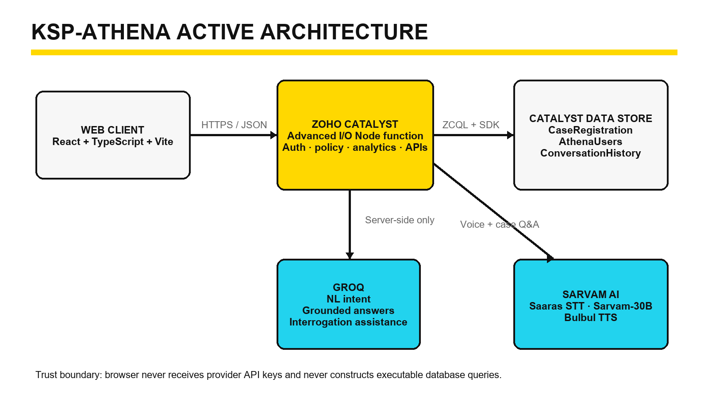
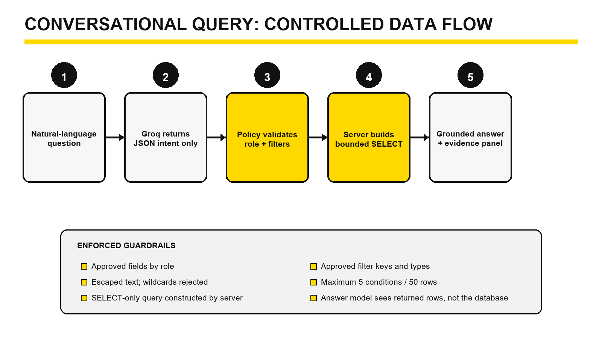
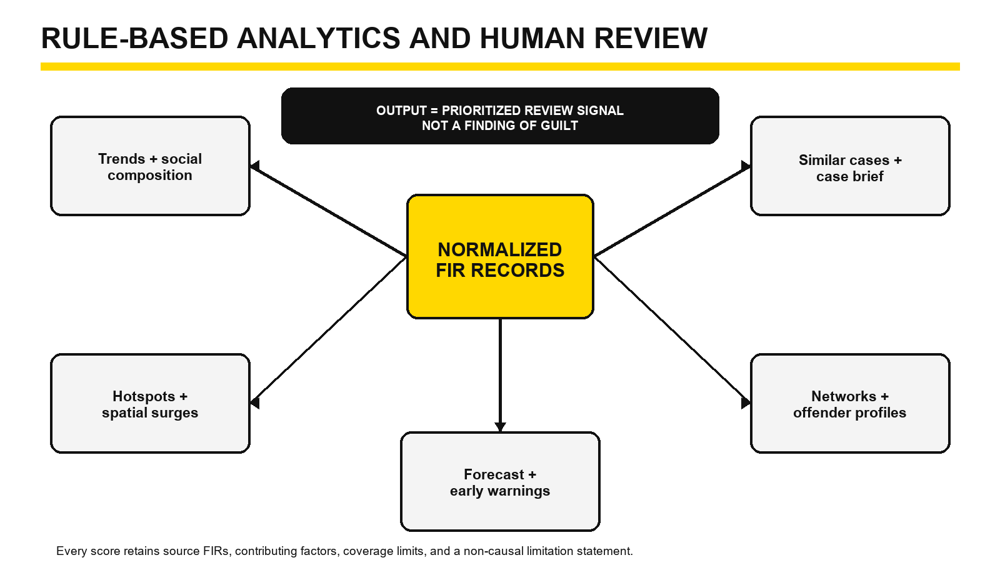

# KSP-ATHENA

> An explainable, bilingual crime-intelligence workspace for natural-language FIR search, case investigation, relationship analysis, and preventive decision support.

[](frontend/package.json)
[](frontend/package.json)
[](catalyst.json)
[](#testing)
[](#project-status)

## Try the live demo

**[Open KSP-ATHENA](https://ks-intellipol-60077550150.development.catalystserverless.in/app/index.html)**

Choose **TRY DEMO** on the login screen to start a short-lived **Argos** session.

> **Demo safety notice:** This is a hackathon prototype built for synthetic test data. Do not enter real complaints, personal information, evidence, passwords, or operational police data. The Argos demo currently has full feature access, including case registration.

---

## What is KSP-ATHENA?

Police databases contain useful information, but finding it normally requires knowing the database structure, exact field names, and several separate tools.

KSP-ATHENA lets an authorized user ask ordinary questions such as:

- “Show vehicle thefts reported in Koramangala this month.”
- “Which cases mention the same accused?”
- “Were the suspects’ faces visible in this statement?”
- “Which divisions show a recent increase in cybercrime?”

The platform converts the question into a controlled database lookup, retrieves only the information allowed for that user, and displays both the answer and its supporting evidence.

It also helps users:

- understand a single FIR in depth;
- talk to an individual case in English or Kannada;
- discover similar cases and recorded relationships;
- review crime trends and geographic concentrations;
- inspect repeat recorded associations and possible networks;
- view transparent forecasts and early-warning signals;
- download case and conversation reports; and
- review a signed operational audit trail.

KSP-ATHENA is designed to **support human investigation**, not replace it. Its scores and alerts are review signals—not findings of guilt or guarantees about future crime.

## A simple walkthrough

1. Start a demo session or sign in with an authorized account.
2. Use the **Dashboard** to understand the current jurisdiction and case distribution.
3. Ask a question in the **Conversational Hub**.
4. Open the evidence panel to see the FIRs, fields, filters, data source, and limitations behind the answer.
5. Load one FIR in **Case Deep Dive**.
6. Review its facts, statement, timeline, evidence leads, and similar cases.
7. Use **Talk About This Case** in English or Kannada, by text or voice.
8. Explore networks, offender review profiles, trends, hotspots, forecasts, social insights, and early warnings.
9. Download a one-page **KSP-ATHENA Report** for the selected case.

## Main features

### Core operations

| Feature | What it provides |
| --- | --- |
| **Dashboard** | Live jurisdiction totals, case status, crime classification breakdown, and basic case lists for a selected division |
| **Conversational Hub** | Natural-language FIR search, follow-up questions, English/Kannada interaction, voice input, PDF export, and a uniform evidence panel |
| **Case Deep Dive** | Structured case facts, victim statement, extractive summary, timeline, evidence leads, similar cases, case report, and case-scoped conversation |
| **Register Fresh FIR** | Validated case registration with a collision-safe crime number |

### Intelligence and analytics

| Feature | What it provides |
| --- | --- |
| **Early Warnings** | Prioritized spatial, repeat-association, network, and aggregate forecast signals |
| **Criminal Network** | Evidence-qualified accused-to-accused and accused-to-case relationships |
| **Offender Profiles** | Explainable review-priority profiles built from recorded FIR associations |
| **Trend Analytics** | Six, twelve, or twenty-four-month trends by time, crime type, division, and victim age band |
| **Spatial Alerts** | Interactive hotspot map, mapping provenance, coverage, and recent concentration alerts |
| **Crime Forecast** | Transparent three-month aggregate forecast with sufficiency and backtest diagnostics |
| **Social Insights** | Descriptive age, crime-type, and geographic composition with explicit non-causal warnings |

### Governance

| Feature | What it provides |
| --- | --- |
| **Role-aware access** | Server-side field, filter, and module permissions |
| **Audit Trail** | Signed operational events, visible to Supervisor and Argos |
| **Explainable AI** | FIR citations, returned fields, filters, reasoning path, row bounds, and limitations |

## Why “Argos”?

Argos evokes the watchful guardian from Greek mythology. It is used here as the full-access demonstration role so visitors can observe the complete platform without creating a permanent account.

In a real public or police deployment, this role would need an isolated synthetic-data tenant, strict quotas, rate limits, automatic cleanup, and reduced privileges.

## Project status

KSP-ATHENA is:

- **ready for a controlled hackathon demonstration;**
- a working integrated prototype with automated tests; and
- built around synthetic or manually entered demonstration records.

KSP-ATHENA is **not yet ready for real police or production data**. Before operational use it would need enterprise identity, independent security assessment, privacy and legal review, real-data validation, end-to-end evaluations, stronger audit storage, observability, scale testing, backup and disaster recovery, and formal operating procedures.

## Complete project handbook

The repository includes a detailed learning and reference document:

**[KSP-ATHENA Complete Project Handbook](docs/KSP-ATHENA_Complete_Project_Handbook.docx)**

It explains the architecture, every technology and its reason, feature algorithms, API, database model, AI guardrails, testing, deployment, production roadmap, career lessons, glossary, demo plan, and 108 judge/interview questions.

---

# Technical documentation

## Active architecture



The deployed application has three main layers:

1. A React web client compiled into static files.
2. One Zoho Catalyst Advanced I/O Node.js function that owns authentication, authorization, validation, database access, analytics, audit logging, and external AI calls.
3. Zoho Catalyst Data Store tables for cases, users, conversation history, and the current audit representation.

Groq and Sarvam AI credentials are used only by the server function. They are never sent to the browser.

## Safe conversational query flow



1. The user asks a natural-language question.
2. Groq returns a small JSON search intent—not SQL.
3. The server checks every requested field, filter, value, sort option, and row limit against the authenticated role.
4. The server constructs the only executable ZCQL `SELECT`.
5. Catalyst returns only permitted fields.
6. The answer model receives those returned rows, not direct database access.
7. The server independently builds the evidence panel.

Controls include role-based allowlists, rejection of raw SQL and unknown properties, escaped text, rejected user wildcards, no more than five filter conditions, a 1–50 row limit, and server-constructed read-only queries.

## Analytics philosophy



The cross-case analytical features are deterministic and testable:

- similar cases use a visible weighted score;
- network edges require a direct recorded link;
- offender profiles expose every contributing point;
- hotspots compare explicit thirty-day windows;
- forecasts use a documented statistical baseline; and
- early warnings retain their trigger, evidence, recommended checks, and limitation.

The language models help interpret and communicate. They do not secretly calculate the analytical scores.

## Technology stack

### Frontend

| Technology | Use | Why it was chosen |
| --- | --- | --- |
| React 19 | Component-based interface | Supports a modular, interactive intelligence workspace |
| TypeScript 5 | Static typing | Reduces interface and payload mistakes before deployment |
| Vite 6 | Development and production build | Fast local feedback and a compact static build |
| React Leaflet + Leaflet | Spatial maps | Established open mapping primitives with React integration |
| Recharts | Charts | Declarative charts for trends, composition, and forecasts |
| react-force-graph-2d | Relationship graph | Interactive network exploration |
| Lucide React | Icons | Consistent, lightweight visual language |
| html2canvas + jsPDF | Local reports | Creates reports without storing another server artifact |
| Vitest + Testing Library | Component tests | Fast, user-oriented frontend testing |

### Backend and cloud

| Technology | Use | Why it was chosen |
| --- | --- | --- |
| Zoho Catalyst | Hosting, function runtime, Data Store, deployment | Keeps the hackathon stack in one managed serverless project |
| Catalyst Advanced I/O | HTTP backend | Supports a multi-route Express application |
| Node.js | Backend runtime | Fits API orchestration and deterministic analytical rules |
| Express 5 | Routes and middleware | Clear endpoint and authentication structure |
| Catalyst Node SDK | Data Store and ZCQL access | Native integration with the selected platform |
| Node `crypto` | Passwords, sessions, IDs, audit signatures | Provides scrypt, HMAC, and secure randomness |
| Axios + Form-Data + Multer | Speech API bridge | Handles bounded audio uploads and provider calls |
| Node test runner | Backend tests | Fast built-in TAP-compatible test execution |

### AI services

| Service | Active use | Safety boundary |
| --- | --- | --- |
| Groq / `llama-3.1-8b-instant` | JSON search intent, grounded answer synthesis, statement interrogation | The server—not the model—authorizes and constructs database queries |
| Sarvam AI / Saaras v3 | English/Kannada speech-to-text | Audio is bounded and handled server-side |
| Sarvam AI / Sarvam-105B | Selected-FIR bilingual case conversation | Receives only the chosen role-permitted FIR and recent bounded turns |
| Sarvam AI / Bulbul v3 | Spoken case answer | Voice output remains a review aid |

> The Sarvam implementation uses **case-scoped prompt grounding**, not model fine-tuning. No model weights are trained by this project.

## Active versus experimental code

The current Catalyst deployment contains only:

- `frontend/build`; and
- `functions/ks_intelli_pol_function`.

The folders under `backend/` contain earlier Node and Python experiments. They are retained for reference but are **not part of the active deployment**. Do not describe FastAPI, NetworkX, scikit-learn, or the legacy orchestration backend as currently running.

## Repository structure

```text
KSP-Athena/
├── frontend/                         # Active React + TypeScript application
│   └── src/components/               # Dashboard, chat, Deep Dive, analytics, governance
├── functions/
│   └── ks_intelli_pol_function/      # Active Catalyst Advanced I/O backend
├── database/
│   ├── *.schema.md                   # Catalyst table documentation
│   └── seed/                         # Labeled synthetic datasets and utilities
├── config/
│   ├── karnataka-divisions.json      # Pincode/division reference
│   └── prompts/                      # Reference prompt assets
├── backend/                          # Dormant experimental services
├── docs/                             # Handbook and architecture diagrams
├── scripts/                          # Handbook build/validation utilities
├── catalyst.json                     # Active Catalyst deployment targets
└── .catalystrc                       # Catalyst project mapping
```

## Prerequisites

- Node.js 20 or newer
- npm
- Zoho Catalyst CLI
- Access to a Zoho Catalyst project
- Groq API key
- Sarvam AI API key

## Environment variables

Copy the function example file for local development:

```powershell
Copy-Item functions/ks_intelli_pol_function/.env.example `
  functions/ks_intelli_pol_function/.env
```

Configure:

```dotenv
GROQ_API_KEY=your_server_side_groq_key
SARVAM_API_KEY=your_server_side_sarvam_key
AUTH_TOKEN_SECRET=at_least_32_random_characters
ATHENA_REGISTRATION_CODE=3024
```

Never commit the real `.env`. For deployment, create the same names as encrypted Catalyst function environment variables.

The older `config/env/.env.example` belongs to the dormant prototype design and is not required by the active function.

## Catalyst Data Store setup

The active application expects manually provisioned tables.

### `CaseRegistration`

The features use:

```text
CrimeNo
VictimName, VictimAge, VictimMobile, VictimAddress
AccusedName, AccusedAge, AccusedMobile
Pincode, DivisionName, Latitude, longitude
CrimeTypeID, CrimeTypeName
VictimStatement
CaseStatus
RegisteredAt, RegisteredBy
```

`CrimeNo` must be unique.

### `AthenaUsers` and `ConversationHistory`

- Create [`AthenaUsers`](database/AthenaUsers.schema.md) with a unique `Username`.
- Create [`ConversationHistory`](database/ConversationHistory.schema.md).
- The current signed audit representation also uses `ConversationHistory` with `Language = audit-v1`, as documented in [`ConversationLog.schema.md`](database/ConversationLog.schema.md).

## Install dependencies

```powershell
Set-Location frontend
npm ci

Set-Location ../functions/ks_intelli_pol_function
npm ci
```

The dormant prototype folders are not required to run the active application.

## Run locally

From the project root:

```powershell
catalyst serve
```

For frontend-only development:

```powershell
Set-Location frontend
npm run start
```

The frontend calls `/server/ks_intelli_pol_function`. Running Vite alone can display the interface, but API features require Catalyst local serving or an equivalent reverse proxy.

## Testing

Backend:

```powershell
Set-Location functions/ks_intelli_pol_function
npm test
```

Frontend:

```powershell
Set-Location frontend
npm test
```

Current verified baseline:

```text
Backend:  86 passed
Frontend: 23 passed across 6 test files
Total:   109 passed, 0 failed
```

The tests cover authentication, safe query policy, FIR validation, conversation history, evidence extraction, explainability, audit integrity, synthetic data, and deterministic analytical rules.

They do not replace deployed end-to-end, load, penetration, accessibility, bilingual-quality, or real-data evaluations.

## Build

```powershell
Set-Location frontend
npm run build
```

The build performs a TypeScript check before creating `frontend/build`.

## Deploy to Zoho Catalyst

1. Confirm the correct Catalyst project and environment.
2. Configure encrypted function environment variables.
3. Run all backend and frontend tests.
4. Build the frontend.
5. Deploy from the repository root:

```powershell
catalyst deploy
```

`catalyst.json` deploys the compiled client and `ks_intelli_pol_function`.

After deployment, smoke-test login/demo, Dashboard, conversational search, evidence citations, Case Deep Dive, voice, reports, analytics, FIR registration, and Audit Trail.

## Active API

| Method | Route | Responsibility |
| --- | --- | --- |
| POST | `/auth/register` | Register a user |
| POST | `/auth/login` | Create an eight-hour signed session |
| POST | `/auth/demo` | Create a thirty-minute Argos session |
| POST | `/chat` | Controlled conversational search |
| GET | `/conversation-history` | Load one user/session history |
| GET | `/audit-events` | Read signed audit events |
| POST | `/register` | Validate and insert an FIR |
| POST | `/fetch-case` | Load one role-filtered FIR |
| POST | `/case-intelligence` | Similar cases and repeat associations |
| POST | `/case-brief` | Extractive summary, timeline, and leads |
| POST | `/case-conversation` | Selected-case Sarvam conversation |
| POST | `/interrogate` | Statement-grounded Q&A |
| GET | `/dashboard-metrics` | Dashboard totals and selected cases |
| GET | `/trend-analytics` | Descriptive trends |
| GET | `/spatial-hotspots` | Map, coverage, and spatial alerts |
| GET | `/offender-profiles` | Review-priority profiles |
| GET | `/sociological-insights` | Descriptive social composition |
| GET | `/crime-forecast` | Transparent aggregate forecast |
| GET | `/criminal-network` | Evidence-qualified network |
| GET | `/early-warnings` | Prioritized review alerts |
| POST | `/transcribe` | Sarvam speech-to-text |

All routes after authentication are protected by server-side session verification.

## Roles

| Role | Typical access |
| --- | --- |
| Constable | Basic case fields and general analytics |
| Investigator | Case statements, investigation filters, networks, profiles, and warnings |
| Analyst | Full analytical and investigation fields |
| Supervisor | Full access plus audit and administrative seed controls |
| Argos | Short-lived full demonstration access |

Registration currently uses a shared four-digit code and lets the registrant choose a role. This is a hackathon convenience—not a production identity design.

## Synthetic data

The project includes two clearly labeled, idempotent test datasets:

- V1: 25 FIRs, crime numbers `926001`–`926025`
- V2: 30 FIRs, crime numbers `927001`–`927030`

They cover all supported crime types, multiple Karnataka divisions and dates, long statements, repeat names, co-accused relationships, financial references, hotspots, and selected cross-case links.

Synthetic data demonstrates feature behavior. It does not prove accuracy, fairness, causality, or operational effectiveness on real police data.

## Security and responsible-use design

Implemented controls include:

- server-only provider credentials;
- scrypt password hashes with random salts;
- expiring HMAC-signed sessions;
- server-side role and field policy;
- bounded and validated requests;
- no execution of model-generated SQL;
- selected-FIR-only case conversation;
- statement text treated as untrusted evidence;
- visible evidence, coverage, and limitation metadata;
- signed audit payloads; and
- non-guilt and non-causal warnings on analytical outputs.

Important remaining gaps include enterprise identity and MFA, an isolated public demo tenant, managed sessions instead of localStorage, WAF/CAPTCHA/rate and cost controls, append-only audit storage, formal privacy and security review, retention and disaster recovery, full end-to-end evaluations, and removal of the fixed 300-record analytical cap.

## Known functional limitations

- Social Insights does not yet have gender, income, occupation, education, migration, urbanization, or external socio-economic indicators.
- Financial crime support is limited to references found in FIR text and recorded identifiers; no transaction feed or money-trail workflow is integrated.
- Spatial mapping uses direct coordinates, same-pincode centroids, and only five Bengaluru fallback pincodes.
- FIR registration does not yet derive `DivisionName` from the pincode map and uses the incident date as `RegisteredAt`.
- The forecast is a transparent aggregate baseline, not a validated operational prediction model.
- Most cross-record modules retrieve no more than 300 rows.
- The disconnected Python/Node prototypes should be integrated deliberately or removed before production.

## Production roadmap

1. **Public-demo hardening:** isolated synthetic tenant, cleanup, CAPTCHA, rate and cost limits.
2. **Engineering foundation:** CI/CD, validation, observability, rollback, backup, and disaster recovery.
3. **Identity and governance:** enterprise SSO/MFA, administrator roles, append-only audit, privacy and legal controls.
4. **Data reliability:** authoritative integrations, lineage, quality rules, entity resolution, statewide geocoding, analytical storage.
5. **AI assurance:** English/Kannada gold sets, groundedness evaluation, prompt-injection red teaming, model monitoring.
6. **Advanced capability:** lawful financial analysis, external social indicators, collaborative workflows, and mobile/offline support.

## Responsible interpretation

- A matching accused name does not prove two records concern the same person.
- A network edge records an association; it does not prove an organized gang or common intent.
- A priority score ranks records for review; it does not predict guilt or future offending.
- A hotspot can reflect reporting and data coverage as well as underlying events.
- A social composition difference is not evidence of causation.
- A forecast is uncertain and aggregate; it must not be used to predict individuals.
- Every operational decision remains with authorized human officers following applicable law and procedure.

## License

No open-source license has been granted yet. The source is published for project demonstration and review. Add an explicit license before allowing reuse, modification, or redistribution.
